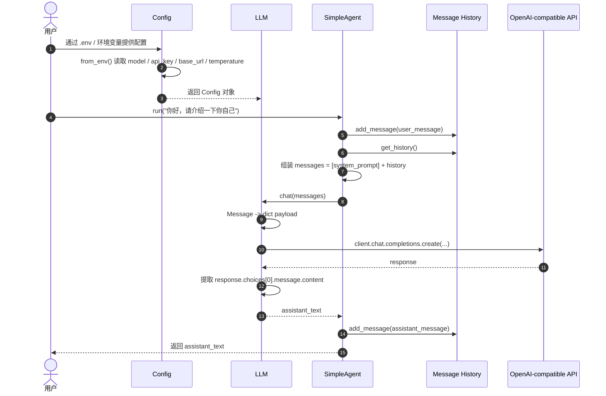
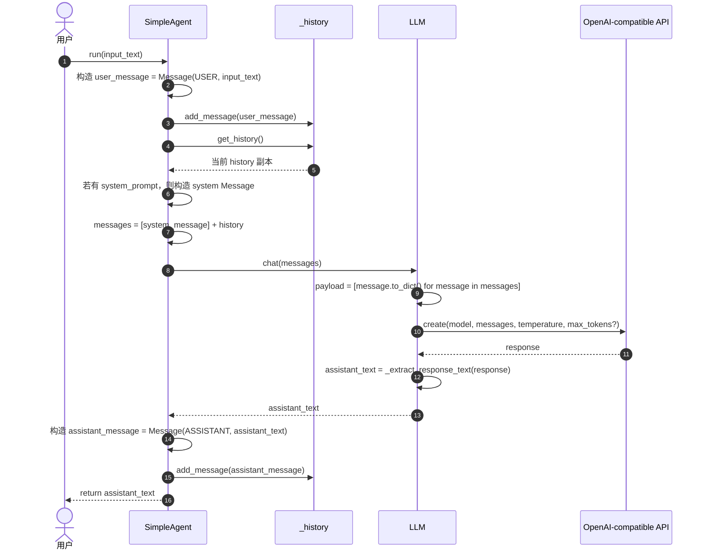

# `Config -> LLM -> SimpleAgent -> Message History` 调用时序图

## 1. 这份图想说明什么

这张图不是在讲“OpenAI SDK 怎么用”，而是在讲你当前 Agent 框架里，一次对话请求是如何沿着下面这条链路流动的：

```text
配置进入系统
-> LLM 根据配置准备调用器
-> SimpleAgent 组织本轮上下文
-> Message History 保存会话状态
-> LLM 发起真实请求并返回文本
-> Agent 把回复写回历史
```

你可以把它当成阶段五和阶段四之间的“拼图图纸”。

---

## 2. 主时序图



---

## 3. 按阶段拆开理解

## 3.1 配置进入系统

起点是 [config.py](file:///Users/bytedance/code/my_agent_framework/my_agents/core/config.py)。

这里做的事情是：

1. 从环境变量读取配置。
2. 校验 `OPENAI_API_KEY` 是否存在。
3. 给 `model`、`base_url`、`temperature`、`max_tokens` 提供默认值或解析逻辑。
4. 最终产出一个 `Config` 对象。

这一层的结果不是“发请求”，而是：

```text
把外部配置整理成框架内部可用的配置对象
```

也就是：

```python
config = Config.from_env()
```

---

## 3.2 LLM 根据配置准备调用器

然后进入 [llm.py](file:///Users/bytedance/code/my_agent_framework/my_agents/core/llm.py)。

`LLM.__init__()` 会做两件事：

1. 接收 `Config`
2. 根据 `api_key` 和 `base_url` 创建底层 OpenAI-compatible client

对应关系是：

```python
config = Config.from_env()
llm = LLM(config=config)
```

此时 `LLM` 已经具备了“真实调用模型”的能力，但它还没有开始对话。

你可以把它理解成：

```text
Config 是参数包
LLM 是拿着参数包准备好的调用器
```

---

## 3.3 SimpleAgent 开始一轮对话

接下来进入 [simple_agent.py](file:///Users/bytedance/code/my_agent_framework/my_agents/agents/simple_agent.py)。

当用户调用：

```python
agent.run("你好，请介绍一下你自己")
```

`SimpleAgent.run()` 内部会开始一轮最小对话主循环。

这一步不会直接调用 OpenAI SDK，而是只做 Agent 自己该做的事：

1. 把用户输入包装成 `Message`
2. 把这条 user message 写入历史
3. 取出历史并和 `system_prompt` 一起组装成 `messages`
4. 调用 `llm.chat(messages)`

所以这一步的重点是：

```text
Agent 负责组织上下文，不负责底层请求细节
```

---

## 3.4 Message History 在这里扮演什么角色

`Message History` 对应的是 `Agent` 基类内部的 `_history`。

相关代码在：

- [agent.py](file:///Users/bytedance/code/my_agent_framework/my_agents/core/agent.py)

它的职责是保存当前会话里的消息状态。

在当前实现里，`_history` 主要保存：

- `user` 消息
- `assistant` 消息

而 `system_prompt` 不直接存进 `_history`，而是在每轮调用时动态拼进去。

所以这里有三个不同层次的东西：

- `system_prompt`
  - 运行配置
- `_history`
  - 会话状态
- `messages`
  - 本轮真正发给模型的上下文

这一点非常重要，因为它是你后面理解 Tool、ReAct、Memory 的基础。

---

## 4. 一轮真实调用的详细展开图

下面这张图把 `SimpleAgent.run()` 内部做的事情拆得更细。



---

## 5. 这一轮到底谁负责什么

你可以把整个链路记成下面这张“职责表”。

| 组件 | 负责的事情 | 不负责的事情 |
| --- | --- | --- |
| `Config` | 读取和保存模型配置 | 发请求、维护对话历史 |
| `LLM` | 调用模型、转换消息格式、解析响应 | 决定何时调用模型、组织多轮对话 |
| `SimpleAgent` | 组织上下文、维护对话流程 | 解析环境变量、直接调用 SDK |
| `Message History` | 保存 user / assistant 会话状态 | 读取环境变量、发网络请求 |

这个拆分非常关键，因为它意味着：

```text
每一层都只做自己那一层的事
```

这正是框架可扩展的基础。

---

## 6. 为什么要这样拆

如果不这么拆，很容易写成下面这种耦合结构：

```text
SimpleAgent
-> 直接读环境变量
-> 直接创建 OpenAI client
-> 直接调 SDK
-> 直接解析 response
-> 再自己维护 history
```

这种写法虽然短期也能跑，但会带来这些问题：

1. `SimpleAgent` 职责过重。
2. 测试困难，很难分别验证配置、调用、流程。
3. 后续换 provider 或换调用方式时改动范围太大。
4. `FakeLLM` 和真实 `LLM` 很难保持同一接口。

而你现在的设计是：

```text
Config -> LLM -> SimpleAgent
```

好处是：

1. `Config` 可以单独测试。
2. `LLM` 可以注入 fake client 做单测。
3. `SimpleAgent` 可以同时兼容 `FakeLLM` 和真实 `LLM`。
4. 后面做 `ToolAgent` / `ReActAgent` 时，调用模型的接口仍然不变。

---

## 7. 把 `FakeLLM` 也串进来理解

为了更直观，你还可以把阶段三和阶段五对照起来看。

### 阶段三到阶段四的链路

```text
SimpleAgent -> FakeLLM
```

### 阶段五之后的链路

```text
Config -> LLM -> SimpleAgent
```

注意最关键的一点：

`SimpleAgent` 调模型的代码几乎没变，仍然是：

```python
self.llm.chat(messages)
```

这说明前面的抽象设计是成功的。

也就是说，阶段五不是推翻前面的实现，而是把：

```text
假模型
```

替换成了：

```text
真实模型适配层
```

---

## 8. 一次调用结束后，history 里有什么

假设第一次调用：

```python
agent.run("你好，请介绍一下你自己")
```

结束后，`_history` 中有两条消息：

1. `Message(role=user, content="你好，请介绍一下你自己")`
2. `Message(role=assistant, content="...模型回复...")`

如果第二次再调用：

```python
agent.run("我刚才问了什么？")
```

那么本轮发给 `LLM` 的 `messages` 大致是：

1. `system`
2. 第一轮 `user`
3. 第一轮 `assistant`
4. 第二轮 `user`

所以连续对话成立，不是因为模型“自己记住了”，而是因为：

```text
Agent 每一轮都把历史重新组织后发给模型
```

这句话非常值得记住。

---

## 9. 你最该记住的核心链路

如果把整套流程压缩成最核心的 6 句话，可以记成这样：

1. `Config` 负责把外部配置整理成内部对象。
2. `LLM` 负责拿着配置去调用真实模型。
3. `SimpleAgent` 负责把用户输入和历史消息组织成上下文。
4. `Message History` 负责保存会话状态。
5. `LLM.chat(messages)` 是 Agent 和模型之间的统一接口。
6. 多轮对话的本质是“每轮重新拼接 history 再发给模型”。

---

## 10. 一句话总结

这条链路真正表达的是：

```text
Config 负责提供参数，
LLM 负责完成模型适配，
SimpleAgent 负责组织对话流程，
Message History 负责保存会话状态。
```

只要你把这 4 个角色分清楚，后面的 Tool、ReAct、Memory、RAG 都是在这条链路上继续扩展。
