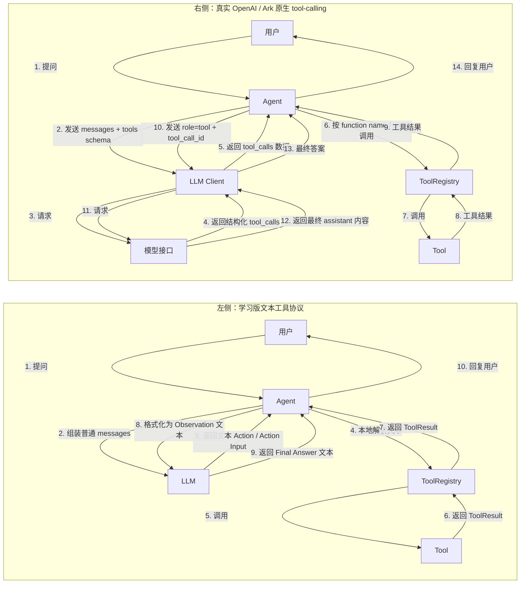
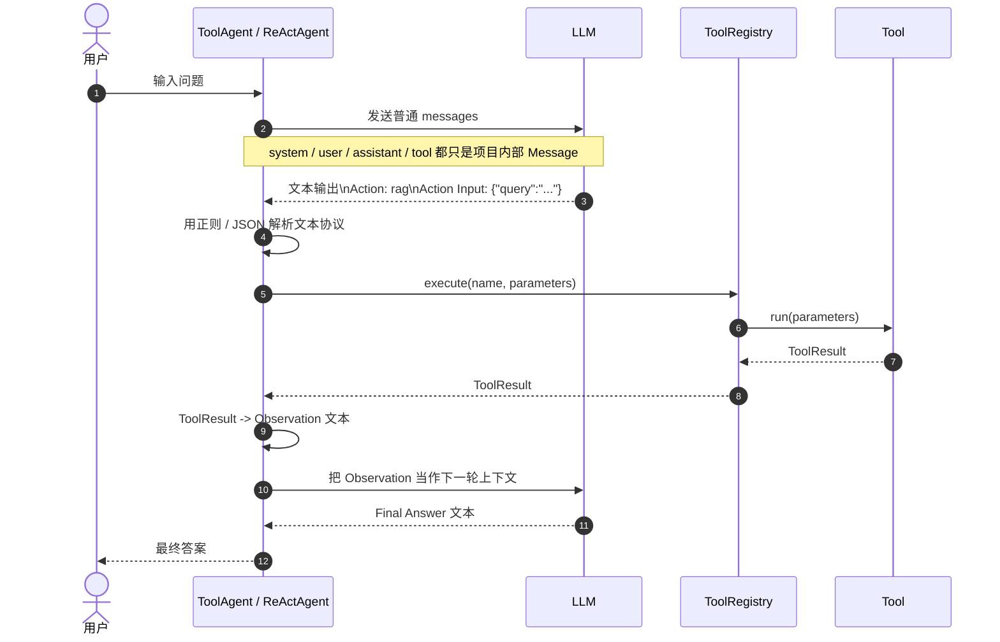
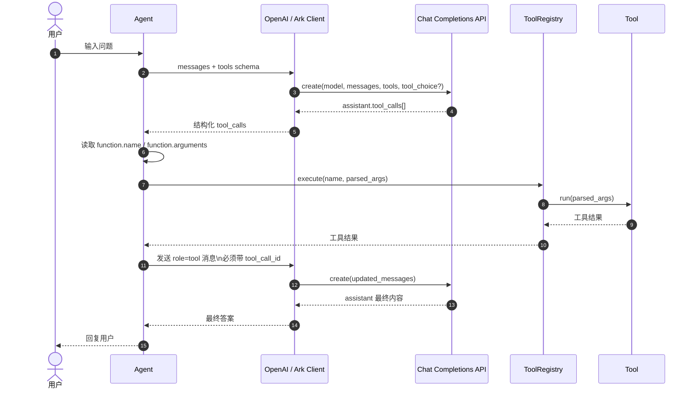

# 学习版工具协议 vs 真实 Tool-Calling 协议

这份文档专门回答一个问题：

```text
为什么项目里的“学习版文本工具协议”可以帮助理解 Agent，
但接到真实 OpenAI / Ark 接口时，又会遇到 role=tool / tool_call_id 这类协议问题？
```

相关代码：

- [tool_agent.py](file:///Users/bytedance/code/my_agent_framework/my_agents/agents/tool_agent.py)
- [react_agent.py](file:///Users/bytedance/code/my_agent_framework/my_agents/agents/react_agent.py)
- [llm.py](file:///Users/bytedance/code/my_agent_framework/my_agents/core/llm.py)
- [message.py](file:///Users/bytedance/code/my_agent_framework/my_agents/core/message.py)

---

## 1. 左右对比总览图

下面这张图先给出一眼能看明白的总览：



这张图里最关键的区别只有一句话：

- 学习版：**工具调用信息藏在文本里**
- 真实版：**工具调用信息放在结构化字段里**

---

## 2. 学习版时序图

这就是你当前 `ToolAgent` / `ReActAgent` 的核心思路。



学习版有三个特点：

1. 模型返回的是自由文本，不是结构化工具调用对象。
2. Agent 自己负责解析 `Action / Action Input`。
3. Observation 也是普通文本，不需要满足官方接口的 `tool_call_id` 规则。

所以它特别适合教学，因为你能直接看到：

```text
Thought -> Action -> ToolResult -> Observation -> Final Answer
```

---

## 3. 真实 OpenAI / Ark 原生 tool-calling 时序图

原生协议的核心不是“让模型写一段 `Action: ...` 文本”，而是先把工具 schema 发给模型，让模型返回结构化 `tool_calls`。



这条链里，`role=tool` 不是普通消息角色，而是原生协议的一部分。  
它必须和前一轮 assistant 的 `tool_calls[].id` 对得上，所以需要：

```json
{
  "role": "tool",
  "tool_call_id": "call_xxx",
  "content": "..."
}
```

这也是你之前接真实 Ark 接口时会遇到：

```text
missing messages.tool_call_id
```

的根本原因。

---

## 4. 两条链到底差在哪

| 对比项 | 学习版文本工具协议 | 真实 OpenAI / Ark 原生协议 |
| --- | --- | --- |
| 工具调用信息放哪 | assistant 文本里 | `tool_calls` 结构化字段里 |
| 谁来解析 | Agent 自己解析文本 | SDK / Agent 读取结构化字段 |
| `Action Input` 形式 | 文本中的 JSON 片段 | `function.arguments` |
| Observation 回传方式 | 普通文本上下文 | `role=tool` + `tool_call_id` |
| 失败模式 | 正则没匹配到、JSON 解析失败 | schema 不合法、tool_call_id 缺失 |
| 学习价值 | 很高，容易看懂主循环 | 很高，接近生产接口 |
| 工程稳定性 | 依赖模型守格式 | 通常更稳定 |

---

## 5. 为什么当前项目会出现“协议混用”

你当前项目的 Agent 层，仍然是学习版实现：

- [tool_agent.py](file:///Users/bytedance/code/my_agent_framework/my_agents/agents/tool_agent.py)
- [react_agent.py](file:///Users/bytedance/code/my_agent_framework/my_agents/agents/react_agent.py)

这里的工具调用协议本质上是：

```text
Action: <tool_name>
Action Input: {...}
```

然后把工具执行结果写成：

```text
Tool: rag
Status: ok
Content: ...
Error:
```

但 LLM 层后来换成了真实接口：

- [llm.py](file:///Users/bytedance/code/my_agent_framework/my_agents/core/llm.py)

所以冲突就出现在这里：

1. Agent 以为 `Message(role=TOOL, content=...)` 只是“下一轮上下文”
2. 真实 OpenAI / Ark 接口认为 `role=tool` 是原生 tool-calling 协议的一环
3. 如果没有配套的 `tool_call_id`，服务端就会拒绝请求

也就是说，问题不在于工具执行本身，而在于：

```text
项目内部消息协议
!=
真实模型接口协议
```

---

## 6. 当前项目是怎么做兼容的

为了不推翻学习版 Agent 主循环，当前项目在 [llm.py:L51-L70](file:///Users/bytedance/code/my_agent_framework/my_agents/core/llm.py#L51-L70) 做了一层兼容转换：

```text
内部 MessageRole.TOOL
-> 不直接发成真实 API 的 role=tool
-> 而是转成一条普通 user 文本消息
```

可以把它理解成：

```text
“这不是官方 tool message，
只是把工具结果当成一段普通上下文继续喂给模型。”
```

这样保住了两件事：

1. 你前面几阶段建立的学习版 `ToolAgent / ReActAgent` 可以继续工作
2. 真实 OpenAI / Ark 接口不会因为缺少 `tool_call_id` 直接报错

---

## 7. 一句话记忆版

最后把这张图压缩成一句最该记住的话：

```text
学习版协议：工具调用是“文本约定”
真实版协议：工具调用是“结构化接口协议”
```

如果你的目标是**学习 Agent 主循环**，学习版更清晰。  
如果你的目标是**做生产级工具调用系统**，最终要走原生 `tools / tool_calls / tool_call_id` 协议。
